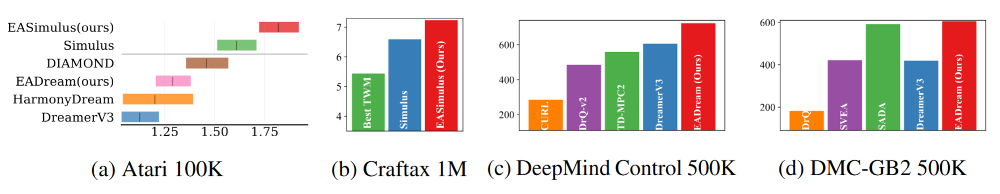

# EAWM
To help understand our intuition and rationale for our framework, we showcase visualization of observations and events generated by our world models on both the Atari, DeepMind Control Suite, and DMC-GB2 benchmark. We also provide experimental results with fixed hyperparameters over 5 random seeds across benchmarks.


## Environment Setup

Please choose one of the instantiations of EAWM from EADream and EASimulus, and follow the instructions in the [EADream/README.md](EADream/README.md) or [EASimulus/README.md](EASimulus/README.md) to configure the environment.

## Atari

### Visualization of Policy

<table>
    <tr>
        <td><center> </center></td>
    <td ><center> </center></td>
    <td><center> </center></td>
        <td><center>  </center></td>
    </tr>
    
</table>


### Automated Event Generator

<table>
    <tr>
        <td><center> </center></td>
    <td ><center> </center></td>
    <td><center> </center></td>
        <td><center>  </center></td>
    </tr>
</table>

### Imagination of Future Observations

<table>
    <tr>
        <td><center> </center></td>
    <td ><center> </center></td>
        </tr>
    <tr>
    <td><center> </center></td>
        <td><center>  </center></td>
    </tr>
</table>

## DMC-GB2

### Visualization of Policy

<table>
    <tr>
        <td><center> </center></td>
    <td ><center> </center></td>
    <td><center> </center></td>
        <td><center>  </center></td>
    </tr>
</table>

### Automated Event Generator
<table>
    <tr>
        <td><center> </center></td>
    <td ><center> </center></td>
    <td><center> </center></td>
        <td><center>  </center></td>
    </tr>
</table>


### Open-loop prediction in train environments
<table>
    <tr>
        <td><center> </center></td>
    <td ><center>   </center></td>
        <td><center>   </center></td>
    </tr>
    <tr>
    <td><center>EAWM</center></td> <td><center>DreamerV3</center></td><td><center> DyMoDreamer</center></td>
    </tr>
</table>

### Open-loop prediction in unseen test environments
<table>
    <tr>
        <td><center> </center></td>
    <td ><center> </center></td>
        <td><center>  </center></td>
    </tr>
        <tr>
    <td><center>EAWM</center></td> <td><center>DreamerV3</center></td><td><center> DyMoDreamer</center></td>
    </tr>
</table>

As demonstrated above, we observe that observation prediction in current MBRL world models generalizes poorly to unseen test environments due to limited interaction diversity in the training environments. In contrast, event prediction is inherently more tractable and interpretable, owing to the sparsity and well-defined semantic structure of events.

## 📈 Results

The folder `results` contains raw scores of world models (for each game, and for each training run).

## Citation
```
@inproceedings{
    Peng2026from,
    title={From Observations to Events: Event-Aware World Models for Reinforcement Learning},
    author={Zhao-Han Peng and Shaohui Li and Zhi Li and Shulan Ruan and Yu Liu and You He},
    booktitle={The Fourteenth International Conference on Learning Representations},
    year={2026},
    url={https://openreview.net/forum?id=OWkkFaq1IZ}
}
```

## Acknowledgements

The code in this repository is built upon the following repositories.

- [https://github.com/danijar/dreamerv3](https://github.com/danijar/dreamerv3)
- [https://github.com/leor-c/Simulus](https://github.com/leor-c/Simulus)
- [https://github.com/fkodom/yet-another-retnet](https://github.com/fkodom/yet-another-retnet)
- [https://github.com/google-research/rliable](https://github.com/google-research/rliable)
- [https://github.com/wandb/wandb](https://github.com/wandb/wandb)
- [https://github.com/thuml/HarmonyDream](https://github.com/thuml/HarmonyDream)
- [https://github.com/NM512/dreamerv3-torch](https://github.com/NM512/dreamerv3-torch)
- [https://github.com/aalmuzairee/dmcgb2](https://github.com/aalmuzairee/dmcgb2)